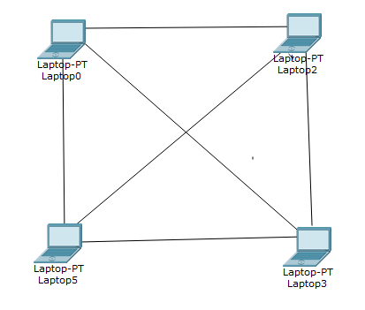
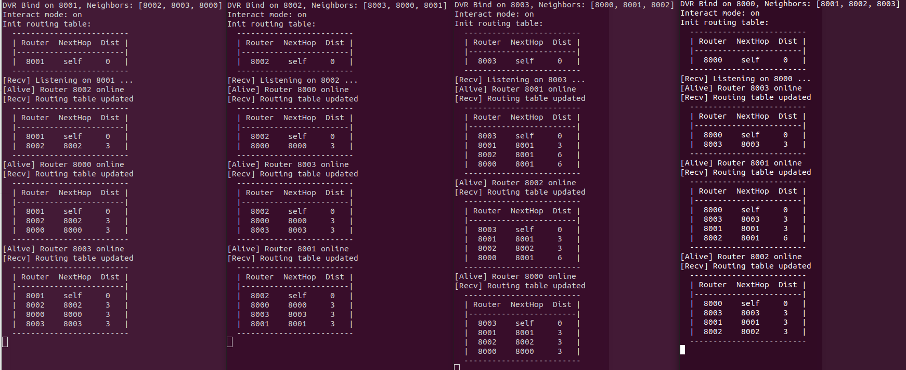

# Distance Vector Routing

Simulated the Distance Vector Routing using sockets in python3.

## How to run

```bash
bash run.sh
```

## Information

 - The bash script creates 4 terminals. The implemented topology is shown below.



 - It measures the distance by the number of routers a packet has to pass, one router counts as one hop.
 - The routing tables are automatically shared between the neighbors.

## Supported Commands

| About 							| Short form | Example  |
-------------------------------------------------------------
| Display routing table 			| T 		 | `T` 		|
| Display current active neighbors 	| N 		 | `N` 		|
| Send data to a node 				| D          | `D 8001`	|
| Refuse a neighbor					| R 		 | `R 8002` |
| Make a neighbour dynamic 			| A 		 | `A 8003` |


## Sample Output


